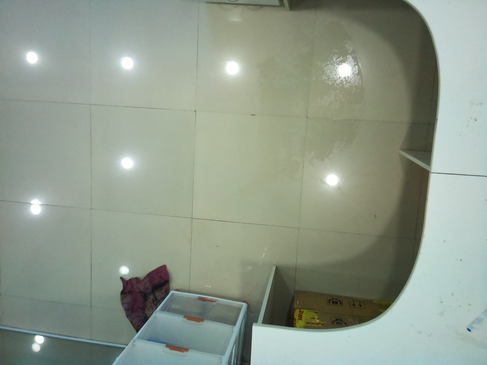

# Water puddle object detection on floor surfaces

## Introduction

Check - https://app.roboflow.com/priyanshu-jha-rnpw3/wet-floor-detection-v1-qdnta/1

Aim is to build stable accurate system that could work on devices with sub-optimal compute resource, to detect wetness/water puddles on floor surfaces.

**Floor Surfaces** here is meant by office floor surfaces, tiles, washroom floor surfaces others. Mostly they are shinny surfaces where detecting water is a really challenging task.

Even with clear focus images there are chances for false positive because of reflection of light on these shinny floors could give a water like effect.

Or the detection simply not happen because model is too much focused on detecing water in dim lights (if we ignore cases where model has to be trained on images with light reflection and water presence).

For Examples: 

